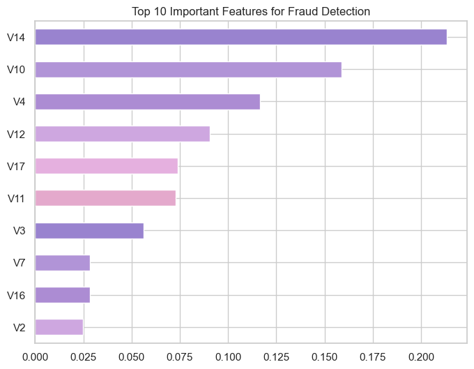

# Fraud Detection in Digital Payment Transactions

Machine learning project for detecting fraudulent credit card transactions using Logistic Regression, Random Forest, and XGBoost.

Fraud detection is a critical challenge in financial technology (FinTech), where millions of transactions occur daily. Early identification of suspicious transactions can significantly reduce financial losses and protect users from unauthorized activities.

This project demonstrates how machine learning can be applied to identify fraudulent transactions in highly imbalanced financial datasets.

---

# Project Overview

The objective of this project is to build a machine learning system capable of detecting fraudulent transactions using historical credit card transaction data.

The project includes:

- Exploratory Data Analysis (EDA)
- Feature Engineering
- Handling imbalanced datasets using SMOTE
- Training multiple machine learning models
- Model performance comparison
- Feature importance analysis
- Business insights for fraud risk monitoring

---

# Dataset

The dataset used in this project contains anonymized credit card transactions made by European cardholders.

Dataset statistics:

- Total transactions: **284,807**
- Fraudulent transactions: **492**
- Fraud ratio: **~0.17%**

This extreme imbalance makes fraud detection a challenging machine learning problem.

---

# Project Workflow

The project follows a standard machine learning pipeline:

1. Data Loading and Exploration  
2. Exploratory Data Analysis (EDA)  
3. Feature Engineering  
4. Handling Imbalanced Data with SMOTE  
5. Model Training  
6. Model Evaluation  
7. Model Comparison  
8. Feature Importance Analysis  
9. Business Insights

---

# Machine Learning Models

Three models were implemented and compared:

### Logistic Regression
A baseline classification model used to establish initial performance.

### Random Forest
An ensemble learning algorithm that improves prediction by combining multiple decision trees.

### XGBoost
A gradient boosting model widely used in real-world machine learning systems due to its strong performance and efficiency.

---

# Model Evaluation

Model performance was evaluated using the following metrics:

- Confusion Matrix
- Precision
- Recall
- F1 Score
- ROC-AUC Score

ROC-AUC is particularly important for fraud detection because it measures the model’s ability to distinguish fraudulent transactions from legitimate ones.

---

# Model Performance Comparison

The models were compared using ROC-AUC score.

Example comparison:

| Model | ROC-AUC |
|------|------|
| Logistic Regression | ~0.97 |
| Random Forest | ~0.99 |
| XGBoost | ~0.99 |

Ensemble models such as Random Forest and XGBoost demonstrated stronger performance in detecting fraud patterns.

---

# Feature Importance

Feature importance analysis was performed using the Random Forest model.

This analysis helps identify which variables contribute the most to detecting fraudulent transactions and provides interpretability for the machine learning model.

---

# Key Insights

Several important insights were observed during the analysis:

- Fraudulent transactions represent a very small percentage of the dataset, highlighting the importance of handling class imbalance.
- Applying SMOTE significantly improved the model's ability to detect fraudulent cases.
- Ensemble models such as Random Forest and XGBoost were more effective at capturing complex fraud patterns.
- Machine learning models successfully detected the majority of fraudulent transactions while maintaining strong ROC-AUC scores.

---

# Business Impact

A machine learning-based fraud detection system can help financial institutions:

- Detect suspicious transactions in real time
- Reduce financial losses caused by fraud
- Improve financial risk monitoring
- Protect users from unauthorized activities

In modern digital payment platforms, machine learning-driven fraud detection has become a critical component of financial security systems.

---

# Technologies Used

- Python
- Pandas
- NumPy
- Scikit-learn
- XGBoost
- Matplotlib
- Seaborn
- Imbalanced-learn
- Jupyter Notebook

---

# Future Improvements

Future work may include:

- Real-time fraud detection pipelines
- Advanced anomaly detection models
- Integration with streaming transaction systems
- Deployment as an API for real-time monitoring

---

# Author

Najwa Zhafarina Alyani Wilujeng

Machine Learning & Data Science Enthusiast
